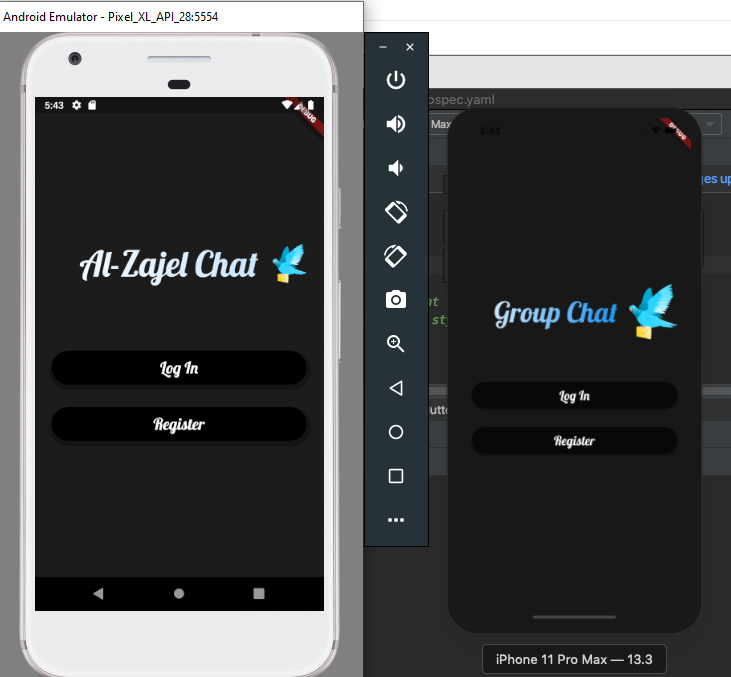
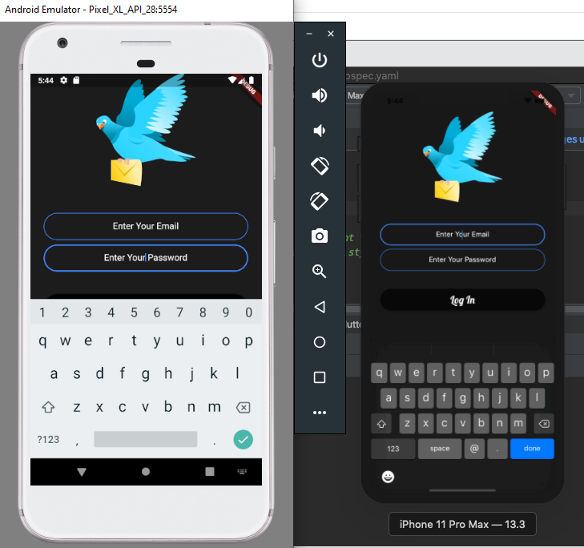
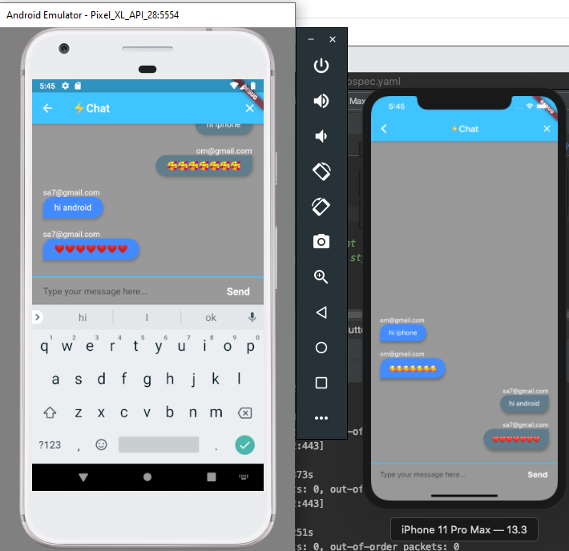

<h1> Al-Zajel chat</h1>
<h1> Chat stored in Firebase </h1> 
<h2> Tested on Android & IOS </h2>
<h3> cool animation , group chat , easy access</h3>

- To use your backend 
- create an acocunt in Firebase
- create new project 
- download google-services.json
- and put in root  android/app/ 

<h2> Screenshot </h2> 

 

 

 

